# YMGUI

面向**嵌入式/裸机优先**的跨平台 GUI 库，C99 + GNU 扩展。软件光栅化 + 保留模式 + 分块刷新，桌面(Linux/SDL)开发、裸机(MCU + LCD)部署，两者共用同一套渲染代码，只换一个显示驱动回调。Windows、Android 和真实硬件的平台逻辑集中在 `SDL_LCD/` 或应用桥接层，不进入控件核心。

当前能力、配置和验证基线见 [当前状态](docs/当前状态.md)；跨平台显示、输入与构建实践见 [跨平台移植](docs/CROSS_PLATFORM_PORTING.md)。

## 状态

27 个具名控件 + base 容器 · 5 类图元 · 35 个 CTest · 28 个独立 demo · 11 个完整应用。
（Button/Label/Checkbox/Switch/Slider/Bar/Image/Arc/Spinner/Meter/TextInput/TextView/EditView/List/Chart/Dropdown/Table/Tabview/TreeView/Grid/Canvas/ColorPicker/Roller/BarChart/MsgBox/FileDialog/Joystick + base 容器）

抗锯齿(4bpp 灰度字体 + Wu 斜线 + 距离场圆弧，`YMGUI_ANTIALIAS` 可裁)、中文/CJK(UTF-8 回退链 + 稀疏字模 + 外部 flash 回调，`YMGUI_FONT_CJK` 可裁)、状态/数据绑定地基均已落地。

## 效果预览

截图由 `./capture_shots.sh` 一键生成(SDL dummy 驱动无头渲染，产物落 `docs/shots/`)。

### 完整应用（`project_Demo/`）

用真实小应用验证"库够不够用"，每个都催生或压榨了一批控件。

| | |
|---|---|
| **闹钟** 三滚轮设时 + 到点弹阻塞模态(MsgBox)<br>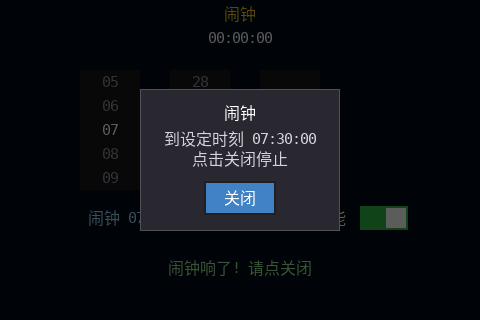 | **实时监控面板** Tabview/Meter/Arc/Chart + 数据绑定<br>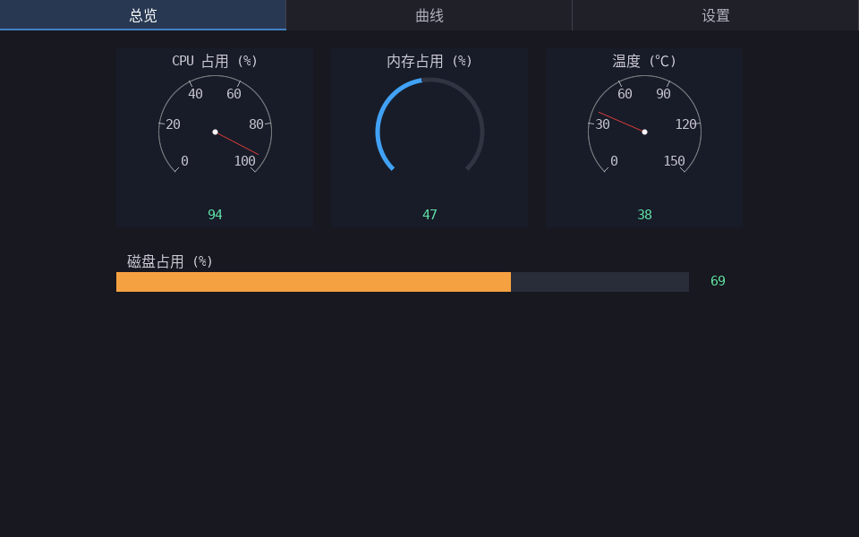 |
| **电子表格** Grid + 公式引擎(SUM/AVG，定点)<br>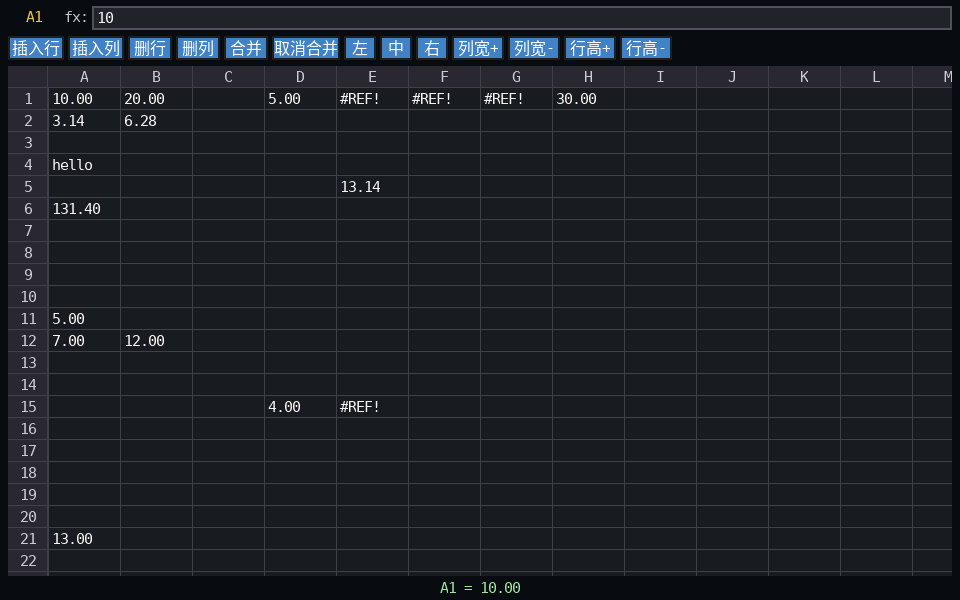 | **文件管理器** TreeView 懒加载 + 预览 + 沙箱增删改<br>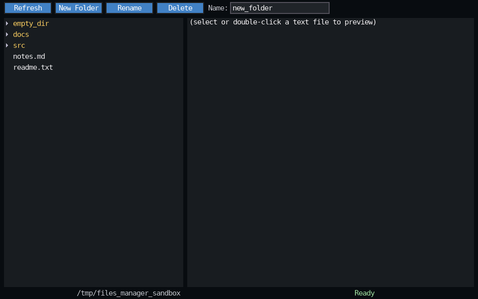 |
| **图层画板** Canvas + ColorPicker + 图层融合/工具<br>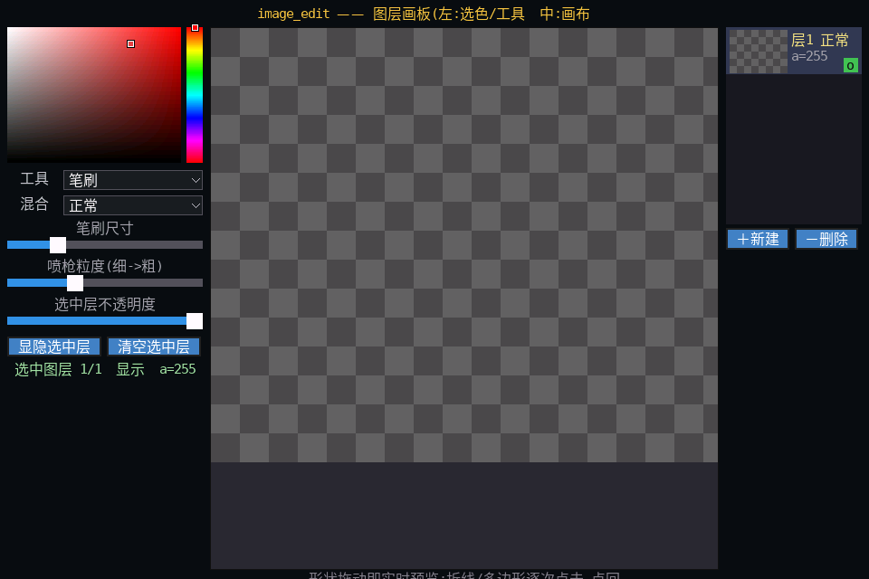 | **音乐播放器** BarChart 频谱 + Roller 歌词 + ffmpeg 解码<br>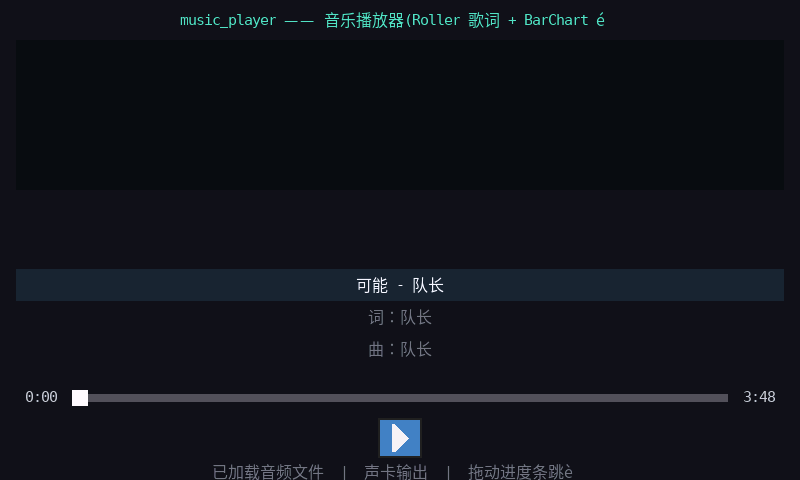 |
| **多行编辑器** EditView 选区/剪贴板/撤销/查找替换 + 菜单栏<br>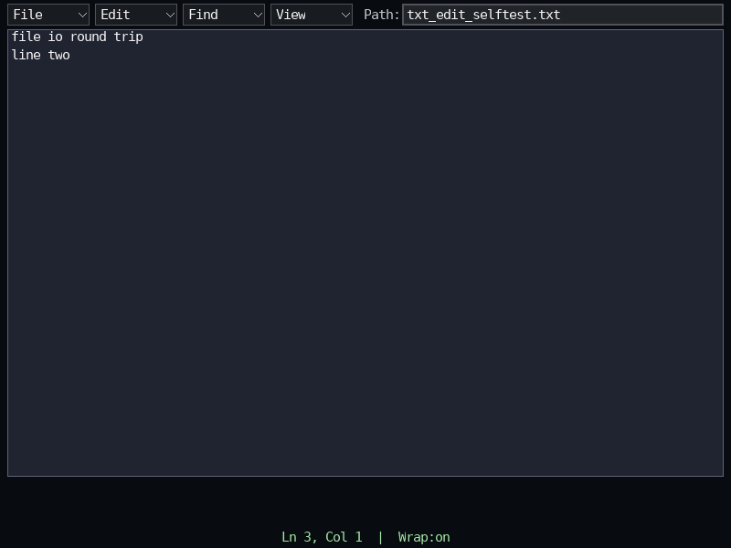 | **视频播放器** Image 缩放模式 + 流式解码 + A/V 同步<br> |
| **上下文手势实验室** 右键/触摸长按菜单 + 捕获式卡片拖动<br>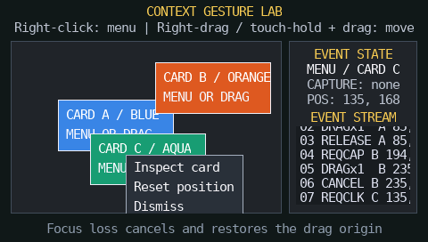 | **插件管理器** 动态加载/卸载 + 插件自建 UI + 生命周期日志<br>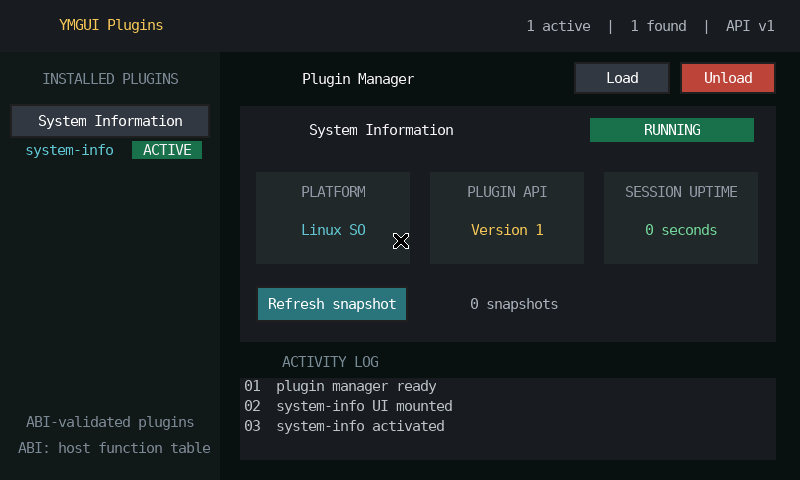 |

### 控件演示（`Demo/`）

<table>
<tr>
<td align="center">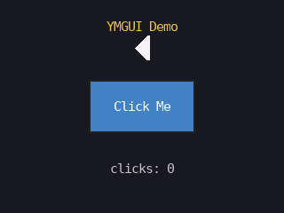<br>button</td>
<td align="center">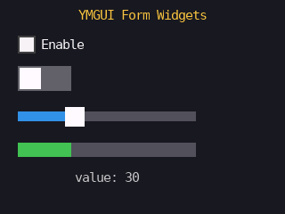<br>form（复选/开关/滑块）</td>
<td align="center">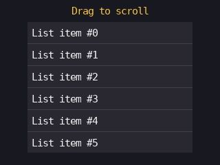<br>list</td>
<td align="center">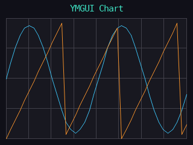<br>chart</td>
</tr>
<tr>
<td align="center">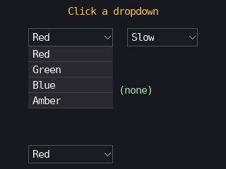<br>dropdown（浮层展开）</td>
<td align="center">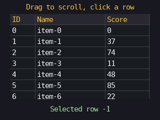<br>table</td>
<td align="center">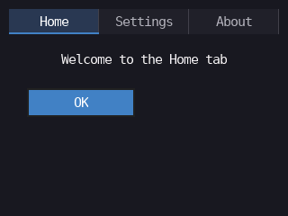<br>tabview</td>
<td align="center">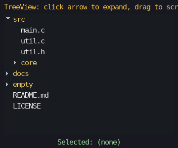<br>treeview</td>
</tr>
<tr>
<td align="center">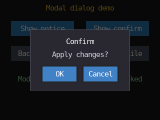<br>msgbox（模态弹窗）</td>
<td align="center">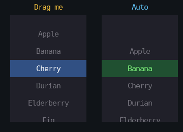<br>roller</td>
<td align="center">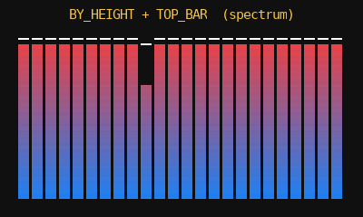<br>barchart</td>
<td align="center">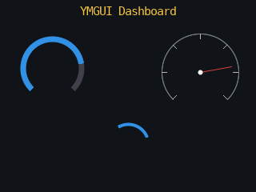<br>dashboard（表盘簇）</td>
</tr>
<tr>
<td align="center">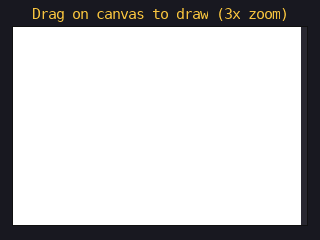<br>canvas</td>
<td align="center">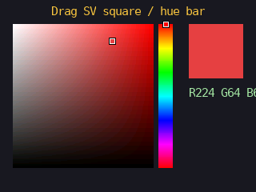<br>colorpicker</td>
<td align="center">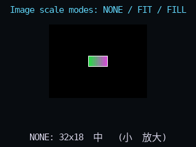<br>image（缩放模式）</td>
<td align="center">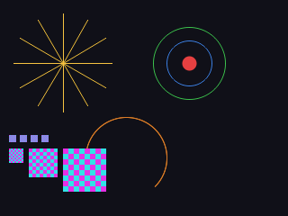<br>draw（图元）</td>
</tr>
<tr>
<td align="center">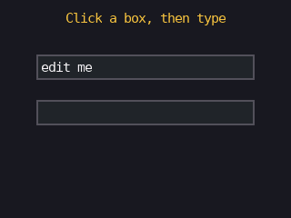<br>textinput</td>
<td align="center">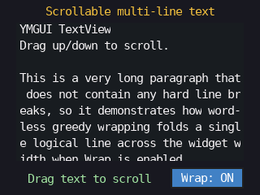<br>textview</td>
<td align="center">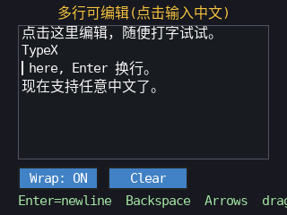<br>editview</td>
<td align="center">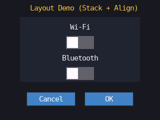<br>layout（Stack/Align）</td>
</tr>
<tr>
<td align="center">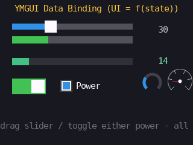<br>bind（数据绑定）</td>
<td align="center">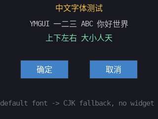<br>font_cjk</td>
<td align="center">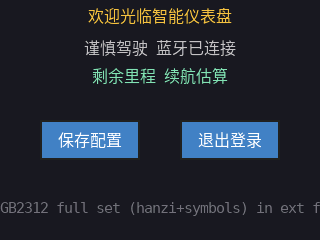<br>font_gb2312</td>
<td align="center">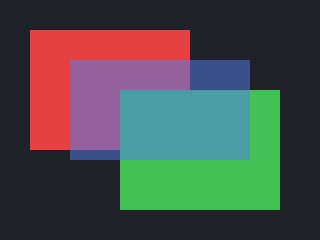<br>flush_band（分块刷新）</td>
</tr>
</table>

## 构建 & 运行

```bash
sudo apt-get install libsdl2-dev      # 仅桌面开发/demo 需要，库本体不依赖 SDL
cmake -B build -S . && cmake --build build
cd build && ctest --output-on-failure # 跑全部单测
./build/demo_dashboard                # 看效果(需显示器)
./build/demo_font_gb2312              # 中文字体(GB2312 全集走外部 flash 回调)
SDL_VIDEODRIVER=dummy ./build/demo_plugin 120 # 插件系统宿主 demo（无头跑 120 帧）

./build_all.sh                        # 一键建库 + 全部 Demo + 11 个 project_Demo 项目
./capture_shots.sh -b                 # 先构建再批量截图到 docs/shots/(无头,需 ffmpeg)
tools/check_repo.sh                   # 文档/字库/计数/路径快速检查
tools/test_matrix.sh                  # RGB565 + RGB888 构建和 35 个 CTest
```

### Android 构建

`project_Demo/ymgui_app.cmake` 原生支持 Android：YMGUI 核心编译为静态库，SDL 假 LCD
作为 SDL2 目标链接，应用目标构建为 shared library。需要 Android NDK、CMake 和 SDL2
导出的 CMake package，也可以通过 `SDL2_SOURCE_DIR` 直接构建 SDL2 源码；再用 NDK
toolchain 指定 ABI：

```bash
cmake -S project_Demo/alarm_clock \
      -B build/android/arm64-v8a/alarm_clock \
      -DCMAKE_TOOLCHAIN_FILE="$ANDROID_NDK_HOME/build/cmake/android.toolchain.cmake" \
      -DANDROID_ABI=arm64-v8a \
      -DANDROID_PLATFORM=android-24 \
      -DSDL2_DIR=/path/to/SDL2/lib/cmake/SDL2 \
      -DYMGUI_COLOR_DEPTH=24
cmake --build build/android/arm64-v8a/alarm_clock
```

使用 SDL2 源码时，将 `-DSDL2_DIR=...` 替换为
`-DSDL2_SOURCE_DIR=/path/to/SDL2`。Android native 目标会自动启用 PIC，并构建为 shared
library，适合由 Gradle/SDL Activity 打包进 APK/AAB。

将 `-DYMGUI_COLOR_DEPTH=16` 改为 24 即可在 Android 构建 RGB565 或 RGB888 framebuffer。
应用层仍需由 Java/Kotlin 或 SDL Activity 桥接生命周期、触摸/软键盘和资源路径；动态插件
按 ABI 放入 APK/AAB 的 native library 目录。完整的显示、输入、资源和插件移植约定见
[跨平台移植](docs/CROSS_PLATFORM_PORTING.md)。

### 插件系统 Demo

`YMGUI/PLUGIN/` 提供一个面向嵌入式约束的轻量插件注册表：插件通过版本化的
`YMGUI_PluginHost` 获取上下文、创建控件和日志能力，支持 `init/tick/deinit` 生命周期。
固件可直接调用 `YMGUI_PluginRegistry_Add` 静态注册；有操作系统的平台还可用
`YMGUI_Plugin_LoadDynamic` 加载导出 `YMGUI_Plugin_Get` 的动态插件（Linux/Android
为 `.so`，Windows 为 `.dll`，macOS 为 `.dylib`），并用
`YMGUI_Plugin_InspectDynamic` 在管理器中筛除 ABI 不兼容或并非插件的动态库。
示例 `demo_plugin` 中的 `system-info` 插件会创建标签并显示运行时间。
完整应用见 `project_Demo/plugin_host/`：宿主提供插件管理界面，动态插件通过宿主
函数表创建自己的指标页和交互按钮，并支持运行时安全卸载、重载。

## 文档导航（按需读）

| 想做什么 | 读哪份 |
|---------|-------|
| **第一次接触，先搞懂现状** | [`docs/当前状态.md`](docs/当前状态.md) |
| **理解架构、扩展库** | [`docs/ARCHITECTURE.md`](docs/ARCHITECTURE.md) |
| **写代码，查控件怎么用** | [`docs/API.md`](docs/API.md) |
| **写代码，守规范** | [`docs/代码风格.md`](docs/代码风格.md) |
| **移植到 Windows、Android 或真机** | [`docs/CROSS_PLATFORM_PORTING.md`](docs/CROSS_PLATFORM_PORTING.md) |
| **了解当前开发进程** | [`docs/DEVLOG_V2.md`](docs/DEVLOG_V2.md) |
| **查看全部文档的分层与归档** | [`docs/README.md`](docs/README.md) |

## 一分钟理解设计

- **最窄腰部**：整个库对硬件只要一个回调 `flush(area, buf)` 把像素推到面板。移植 = 把 `YMGUI/` 整个拷走 + 改 `YMGUI/CONFIG/` + 照 `SDL_LCD/` 写真实 LCD 的 flush。
- **分块刷新**：draw buffer 可远小于整屏，逐块渲染逐块 flush，同一套代码覆盖几十 KB 的 MCU 到桌面。
- **保留模式 + 脏矩形**：控件树持久存在，只重绘变化区域，空闲不耗 —— LCD 的 blit 是最贵操作，这样降到最低。
- **无 FPU 友好**：几何用 int16，三角/渐变查表(Q15 定点)，不走 float 必经路径。
- **中文三轴可裁**：CJK 开关是编译期宏(轴1)，字集范围(精简/GB2312)是字模生成期参数(轴2)，字模存放(内部/外部 flash)是运行期 `glyph_read` 回调(轴3)——各归其位，方案切换不改控件代码。
- **目录对齐前作 YMCV**：可移植的 10 层全收在 `YMGUI/` 库根下（对齐 YMCV 的 `OpenSrc-YMCV/YMCV/`，拷一个文件夹即移植）；CONFIG/DEBUG/COMMON/OPOBJ/CORE 与 YMCV 同名，GUI/HAL/WIDGET/STATE/PLUGIN 为 GUI 新增。

## 维护约定（重要）

当前事实统一维护在 `docs/当前状态.md`，每轮开发过程续写到 `docs/DEVLOG_V2.md`。公开 API、架构、移植或规范变化时，再更新对应专题文档。`docs/history/` 只保留冻结的 V1 和旧快照，需要追溯决策或排查回归时才阅读。具体规则见 [`AGENTS.md`](AGENTS.md)。

`tests/test_*.c` 里的断言即行为规格 —— 改机制先看对应测试，改完让它继续过。
