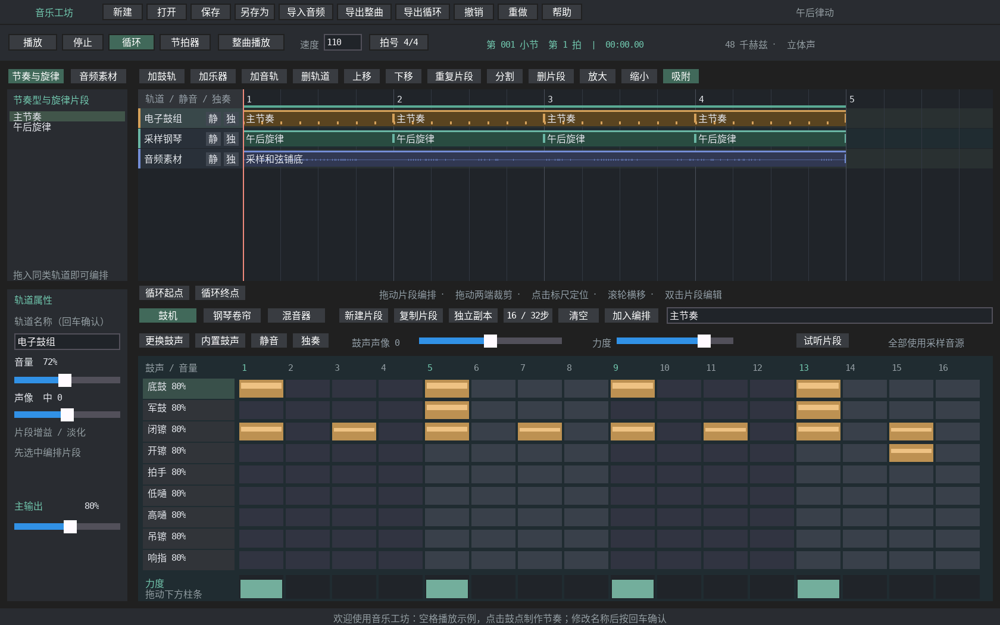
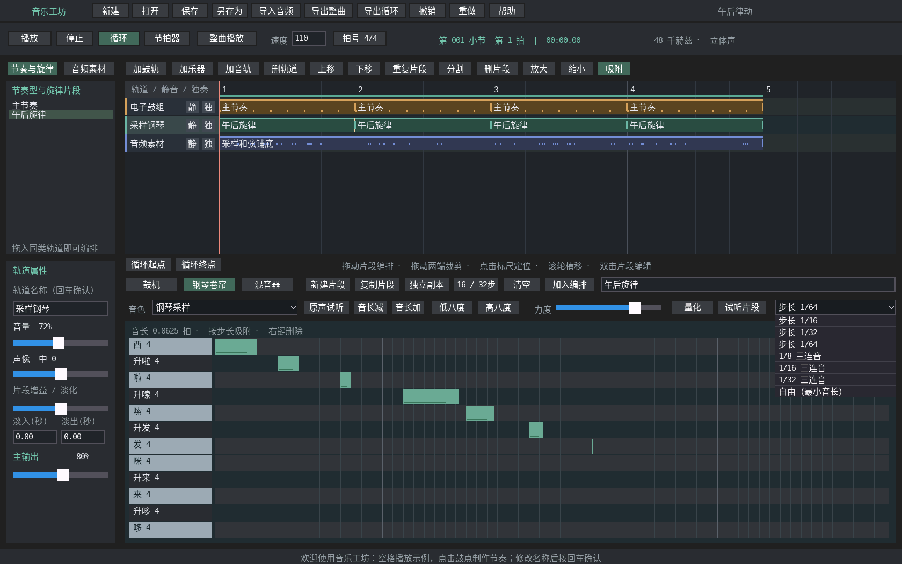
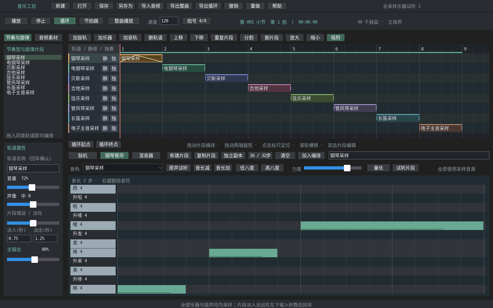
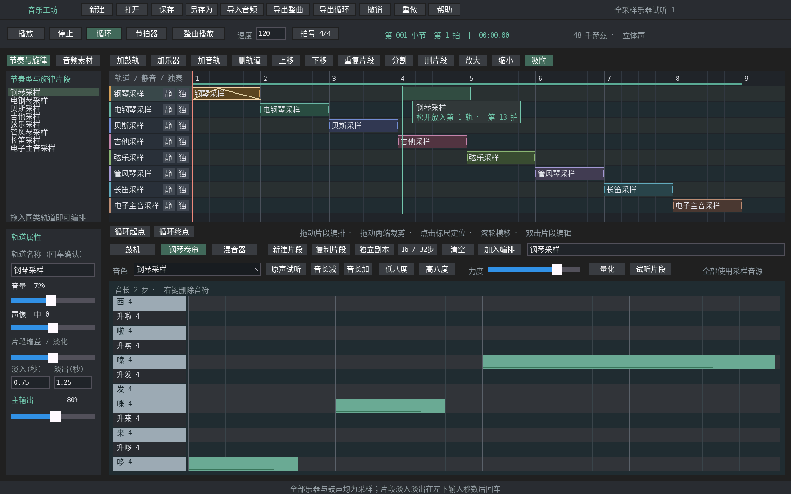
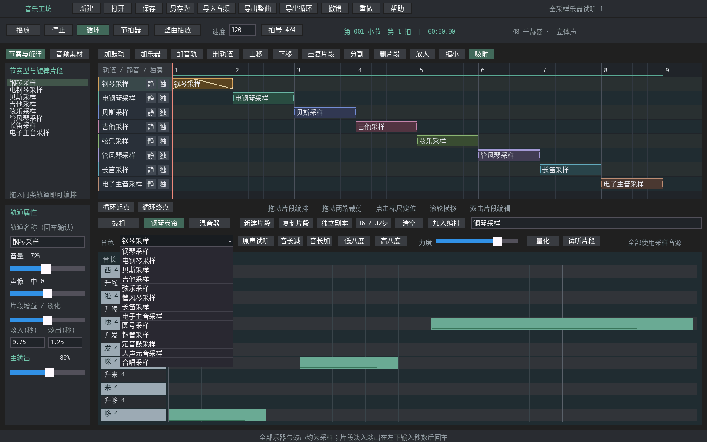
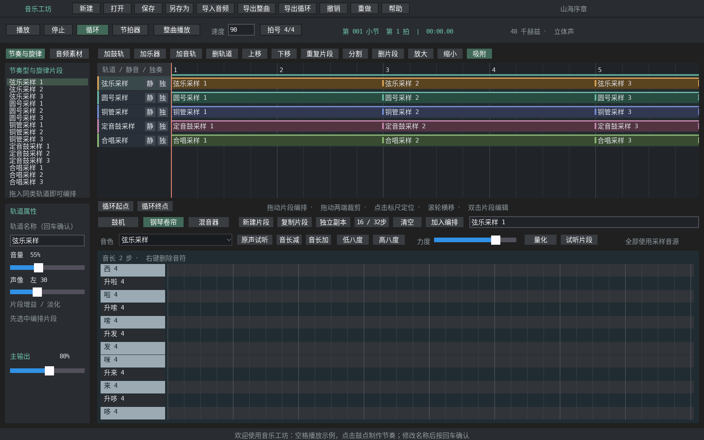

# 音乐工坊 · music_studio

使用 YMGUI 实现的中文音乐制作应用。界面功能、工作区组织和结构化移植以 Ardour 为主要参考；鼓机参考 Hydrogen 的“鼓声行 + 步进网格 + 力度”操作。video_stidio 仅作为 YMGUI 控件、GB2312 字体和文件对话框接入的使用参考。



## 构建与运行

当前支持 Linux 桌面、RGB565 / RGB888，需要 C 编译器、CMake、SDL2 开发包；导入音频和导入测试另需 PATH 中的 FFmpeg 命令行。播放内置工程、保存和导出不需要 FFmpeg。全部内置乐器和鼓声使用随仓库附带的 PCM 采样：13 个乐器 bank 和鼓声 WAV 均位于 `extern_lib/`。应用不链接 FluidSynth；只有重制 SoundFont 派生资源时需要该工具，重制拍手/响指则需要 FFmpeg。正常构建无需重新下载或生成内置采样。

在仓库根目录执行：

```bash
cmake -S project_Demo/music_studio -B build/rgb565/project_Demo/music_studio -DYMGUI_COLOR_DEPTH=16
cmake --build build/rgb565/project_Demo/music_studio -j8
ctest --test-dir build/rgb565/project_Demo/music_studio --output-on-failure
./build/rgb565/project_Demo/music_studio/music_studio
```

RGB888 使用独立的 `build/rgb888/project_Demo/music_studio` 和 `-DYMGUI_COLOR_DEPTH=24`。根目录 `build_all.sh` 与 `capture_shots.sh` 自动枚举本应用。GB2312 字模路径由 CMake 指向仓库 `tools/gb2312_glyphs.bin`；中文源码、文件名和工程名均使用 UTF-8。

程序默认打开“午后律动”：四小节采样鼓组、采样钢琴旋律与从管风琴采样渲染的和弦铺底。13 种乐器和七种鼓声使用 GeneralUser GS 派生 PCM，拍手与响指使用 CC0 实录素材；来源与许可见 [乐器音源](../../extern_lib/GeneralUser-GS/README.md) 和 [拍手/响指](../../extern_lib/BodyPercussion/README.md)。电子主音仍是电子音色，但运行时同样播放采样，没有实时乐器合成。

```bash
# 打开自己的工程
./build/rgb565/project_Demo/music_studio/music_studio --project /完整路径/我的作品.ymmusic
# 无头界面与交互检查
SDL_VIDEODRIVER=dummy SDL_AUDIODRIVER=dummy ./build/rgb565/project_Demo/music_studio/music_studio --selftest
# 有限帧截图 / 启动；也支持 --frames 30
SDL_VIDEODRIVER=dummy SDL_AUDIODRIVER=dummy ./build/rgb565/project_Demo/music_studio/music_studio 30
# 无图形界面导出内置演示；可同时指定 --project
./build/rgb565/project_Demo/music_studio/music_studio --export /完整路径/作品.wav
```

## 可编辑曲库

首批提供五首作品、七个 `.ymmusic` 工程：致爱丽丝、土耳其进行曲、G大调小步舞曲、绿袖子、欢乐颂，含钢琴、长笛/弦乐、吉他、合唱和铜管版本。用左上角 **打开** 载入，音符与音色都可继续编辑；完整曲目与节选在文件名中标明。曲目表、路径、来源许可和重制方法见 [曲库说明](library/README.md)。

原始 MIDI 仅保留本地，不纳入 Git；已有 `.ymmusic` 工程可直接打开试听。重制或运行完整转换回归前，按曲库来源清单恢复 MIDI。离线转换脚本为 [tools/build_library.py](tools/build_library.py)，仅需 Python 3 标准库，按 [catalog.json](library/catalog.json) 生成到 `library/projects/`；可用 `--output` 指定新目录，已被修改的同名工程会拒绝覆盖。配置字段、音色编号、新增曲目和验证步骤已收录在曲库说明中；该脚本不提供应用内通用 MIDI 导入，也不会自动生成 WAV 或 ZIP。

## 已实现的工作流程

短音符编辑、Ctrl＋滚轮缩放、Shift＋滚轮平移、框选和快捷键速查见 [编辑操作指南](docs/编辑操作.md)。

1. **创作鼓点**：九行鼓声为底鼓、军鼓、闭镲、开镲、拍手、低嗵、高嗵、吊镲、响指。在“鼓机”页点击网格开关鼓点。拍手和响指均使用实录采样，保留击打瞬态并经过低频削减/高频均衡；两者是独立行，可同时编排。点击鼓名试听；鼓名上滚轮调音量，鼓点上滚轮调力度，下方力度柱可直接拖动。支持每种鼓的声像、静音、独奏和更换音频采样。
2. **管理节奏型**：新建、命名、复制、清空，选择 16 / 32 步。步长固定为十六分音符。时间线引用同一节奏型时，编辑会同步影响全部引用；“独立副本”只替换当前片段的引用。
3. **写旋律**：切换“钢琴卷帘”，点击空白网格添加音符，拖动移动音高和起点，拖动右端改变长度，右键删除。上方调整力度、音长与八度，支持量化。右侧步长下拉框提供 1/16、1/32、1/64，1/8、1/16、1/32 三连音及自由模式；选择步长同时设置新音符长度，已有音符保持原值。关闭顶部吸附或选择自由模式后，移动、拖动右端及音长加减可按最小单位细调；最短为 1/96 拍，短于一格的音符也能显示和选中。量化使用当前步长，拖动保留原始非网格偏移与长度。音色下拉框统一提供钢琴、电钢琴、贝斯、吉他、弦乐、管风琴、长笛、电子主音、圆号、铜管、定音鼓、人声元音、合唱，共 13 种采样音色；新建乐器轨默认钢琴采样。选择影响当前乐器轨，可撤销并随工程保存。琴键和“原声试听”用于检查当前轨道的音源原声；编排效果使用“试听片段”检查。
4. **编排整曲**：点击左侧片段会同步到实际引用它的轨道及音色；共享片段优先保留当前引用，未编排素材保留当前同类轨道。拖动时有跟随鼠标的卡片和吸附后的落点矩形，绿色表示可放置、红色表示不匹配或超出范围；松手才提交，失焦取消。从素材库将节奏型、旋律或音频拖入同类轨道；也可选择素材、轨道和播放位置后点击“加入编排”。片段可拖动、跨同类轨道移动、两端裁剪、重复、分割、删除和复制粘贴。滚轮横移时间线，放大/缩小按钮调整视野，可切换网格吸附。
5. **导入与混音**：后台导入 WAV / MP3 / FLAC 等 FFmpeg 支持的音频，转换成 48 kHz 立体声 PCM 并生成波形。轨道可添加、删除、命名、调序；轨道和主输出有音量控制，轨道有声像、静音、独奏、电平表。选择编排片段后，在左下输入淡入/淡出秒数（0–10），回车确认，填 0 关闭；全部鼓声、乐器采样和导入音频均适用，时间线上显示淡化斜线。尚未编排的素材会提示先加入轨道。
6. **播放**：选中已编排的鼓、旋律或音频片段后，点“试听片段”即可从片段开头单独循环，保留该段的裁剪偏移、长度、增益和淡化；未编排的鼓/旋律也能试听原节奏型。再次点击“停止试听”结束。试听使用当前同类轨道的音色、音量和声像，忽略轨道静音/独奏但不改写它们；鼓组内部静音/独奏仍有效。顶部“片段循环 / 整曲播放”按钮切回整曲。另有播放、暂停、停止、标尺定位、整曲/当前片段模式、循环起止点、节拍器、每分钟 30–300 拍，拍号支持 3/4、4/4、6/4。独立音频线程持续供音，启动前预填约 85 毫秒缓冲，界面刷新和自动保存不再阻塞音频补给。播放位置按实际声卡队列消耗量推进；无声卡时明确提示，仍可编辑并离线导出。
7. **保存与导出**：`.ymmusic` 单文件包含工程参数及所有导入音频，搬移无需附带原素材。32 步工程撤销/重做；未保存的新建、打开和关闭会确认。整曲或循环范围可导出为 48 kHz / 16 位 / 立体声 WAV，播放与导出使用同一混音函数。

**横向缩放视图**：鼠标放在上方编排轨道或下方钢琴卷帘/鼓机，按住 **Ctrl 滚动滚轮**，向上放大、向下缩小。上下视图独立，尽量固定鼠标指向的时间位置，只改变显示宽度，不改变音符、片段的实际时长，也不产生撤销记录。下方可从整段显示放大到 16 倍，短音符放大后更容易选中和拖动右端；放大后用 **Shift＋滚轮** 或横向滚轮左右移动。上方普通滚轮仍用于横移；下方不按修饰键时保留原来的八度/鼓点力度调整。

**框选已有音符**：钢琴卷帘网格右上方的“框选已有”按钮可以切换开关。开启后，从空白处拖出矩形，碰到的当前可见音符会高亮，左侧显示选中数量；空白处单击只取消选择，不新增音符。拖动选中的任意音符可整体移动，拖动右端可一起改变音长；音长加减、力度和量化也作用于选区。点击“删除所选”删除这一组，支持撤销/重做；失焦取消拖动时恢复原状态。点击未选音符改为单选，关闭开关恢复点击放置。框选仅覆盖当前可见八度，切换片段、离开卷帘、撤销或重做会清除选择，开关不写入工程文件。

名称输入后按回车确认。快捷键：空格播放/暂停、回车停止归零、Delete 在钢琴卷帘内删除所选音符，框选模式下其工具栏也沿用音符删除；时间线内删除所选片段、Ctrl+Z 撤销、Ctrl+Y 重做、Ctrl+S 保存、Ctrl+C / Ctrl+V 复制粘贴时间线片段。文字输入框保留自身编辑快捷键。




正式保存和 WAV 导出先写同目录临时文件，成功后原子替换；加载先解析和校验候选工程，失败保留当前作品。未保存修改每分钟写入当前构建目录的 `user/自动恢复.ymmusic`，下次可手动打开；自动副本不替代正式保存。同一构建目录的多个实例会共用这一恢复路径。







## 全采样音源与试听

全部乐器使用多音区 PCM 插值播放，已移除原来的加法合成与特征合成分支。无需选择音源分类，直接选择乐器。13 个 bank 共约 48.7 MB 文件、97.3 MB 解码 PCM；每个 bank 有 13 个音区，MIDI 36–84、间隔 4 半音、每区 6 秒、24 kHz 单声道。钢琴、电钢琴、贝斯、吉他、定音鼓保留自然衰减；弦乐、管风琴、长笛、电子主音、圆号、铜管、人声和合唱使用交叉淡化循环。

固定力度 100 的单层乐器采样，力度控制播放增益，尚无多力度层、轮替采样、踏板或连奏。极端移调不保证拟真；采样播放也不意味着所有上游素材都是原声乐器实录，例如电子主音。来源、许可证和重制方法见上面的音源文档。所有鼓声也已替换为 PCM；拍手与响指不再依赖合成噪声或振荡器。

旧工程仍可打开：0–12 保留乐器身份并改用采样，上一版重复的采样/特征编号 13–16、17–20 都映射到钢琴、弦乐、铜管、长笛。轨道、音符、片段、淡化及导入素材保留；旧作品的内置音色会因此改变，保存的自定义名称不会自动改写。

可选生成器输出两个可编辑的乐器试听工程（8 轨 + 5 轨，每种乐器 2 秒），以及 4 秒拍手/响指试听（前 2 秒拍手、后 2 秒响指）。请给它一个专用目录：

```bash
cmake --build build/rgb565/project_Demo/music_studio --target music_sound_demo -j8
mkdir -p build/rgb565/project_Demo/music_studio/user/全采样试听
./build/rgb565/project_Demo/music_studio/music_sound_demo build/rgb565/project_Demo/music_studio/user/全采样试听
./build/rgb565/project_Demo/music_studio/music_studio --project build/rgb565/project_Demo/music_studio/user/全采样试听/全采样乐器试听1.ymmusic --tab 1
```

## 交响采样小样

圆号、铜管、定音鼓和合唱都在统一音色列表中选择。圆号适合中低音长句，铜管用于和弦强调，合唱采样与弦乐铺底；定音鼓建议低八度输入较长音符，让自然衰减完整发声。它是带音高的乐器音色，在乐器轨使用。

可选生成器制作“山海序章”：90 BPM、六小节、五条乐器轨（弦乐、圆号、铜管、定音鼓、采样合唱），全长 16 秒。工程可编辑，每轨可独奏对比。

```bash
cmake --build build/rgb565/project_Demo/music_studio --target music_epic_demo -j8
mkdir -p build/rgb565/project_Demo/music_studio/user
./build/rgb565/project_Demo/music_studio/music_epic_demo \
  build/rgb565/project_Demo/music_studio/user/山海序章-全采样.ymmusic \
  build/rgb565/project_Demo/music_studio/user/山海序章-全采样.wav
./build/rgb565/project_Demo/music_studio/music_studio \
  --project build/rgb565/project_Demo/music_studio/user/山海序章-全采样.ymmusic --tab 1
```



生成器会写入所指定的两个输出文件；请使用小样专用路径。`examples/epic_demo.c` 也展示如何通过模型 API 创建多轨作品，产物放在被 Git 忽略的 build 目录。

## 当前边界

- 最多 8 条轨道、16 个节奏型/旋律段、每段 128 个音符、128 个时间线片段、16 项音频素材。编排上限 1024 拍，相当于 256 个 4/4 小节。
- 每项导入音频最长 120 秒，素材总时长不超过 10 分钟；替换鼓声最长 5 秒。音频全部驻留内存，工程文件保存未压缩 PCM。删除片段不会回收素材槽，撤销仍可恢复其引用。
- 音频保持原始播放速度；改变工程速度会改变片段在音乐网格上的时长和裁切范围。尚无自动时间拉伸、节奏检测或音高校正。
- 13 种乐器均为采样播放，人声/合唱仅支持固定元音，不支持歌词演唱。新版保存为 `YMUSIC02` 九鼓布局；读取 `YMUSIC01` 时保留原八行并将响指初始化为空。新版保存后的工程需要新版打开。内置音源更新会改变旧工程的内置声音，用户自定义采样不受影响。
- 音频/MIDI 录制、外接 MIDI 键盘、MIDI 文件导入导出、通用 SoundFont 导入、插件、EQ/压缩/混响、自动化曲线、变速/变拍号和压缩格式导出属于下一阶段。这里的乐器轨是内部音符序列，尚未接入外部 MIDI 协议。
- 音频导入/导出在后台执行，期间禁止模型编辑，退出需等待任务完成；暂未提供取消和百分比进度。工程保存/打开和自动恢复写入在主线程，较大工程可能短暂停顿。桌面视口固定为 1680×1050，时间线和编辑网格加宽，鼓声行高 36 像素、琴键行高 31 像素。
- FileDialog 中文文案使用本轮新增的可选翻译接口；本应用直接从源码构建。现有 `releases/` 预编译 SDK 未在本轮重新打包。

## 验证与后续开发

独立工程有两个 CTest：`music_engine` 覆盖 13 种采样音色的非静音/差异、分块一致性、保存重开及试听轨道隔离，另有音乐时钟、历史、分割后音频连续性、分块混音一致性、静音/独奏/声像、所有音源淡入淡出及试听参数保持、九种鼓声、旧八鼓工程兼容、新九鼓工程与 PCM 往返、坏文件保护及真实 WAV 导入导出；采样另测缺失时不回退合成、加载失败、长音循环边界、旧音色编号映射及长吊镲跨周期尾音；`music_ui` 通过 YMGUI 输入注入覆盖上下视图 Ctrl＋滚轮缩放/鼠标锚点/工程与历史不变、横移、缩放后的音符创建/命中/拉长/框选/组移动与鼓点编辑，以及细分步长与短音符、框选开关/正反向拖框/取消/不新增、成组移动/边界/改音长/力度/量化/删除与撤销重做、选择清理和键盘删除隔离，以及统一采样音色下拉选择/撤销、响指行编辑、新乐器轨/音频轨片段试听、淡化秒数提交及非法值拒绝、素材引用轨道同步、拖动预览/无效落点/取消、单音试听和整曲切换，以及鼓点、拖动、取消、素材编排、钢琴、混音、播放循环以及后台导入后保存重开；另覆盖合唱试听期间主线程重绘与连续停顿超过半秒仍持续供音、模型快照隔离和编辑发布、非循环尾块自然结束、播放导入 PCM 时加载失败/成功的线程收尾。

本机 RGB565 / RGB888 均完成编译和两项测试，AddressSanitizer / UndefinedBehaviorSanitizer 检查通过；真实桌面验证中文窗口、播放与暂停。文件对话框的翻译回归在根工程 `test_filedialog` 中，根 CTest 数量仍为 35。

结构、状态生命周期和扩展入口见 [架构与 AI 开发说明](ARCHITECTURE.md)。
