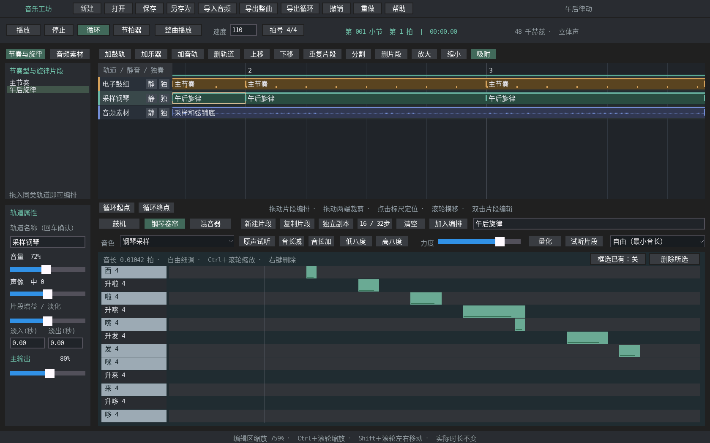
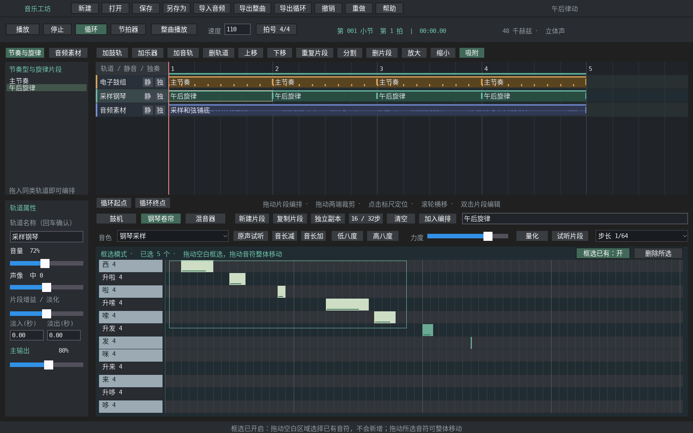

# 音乐工坊编辑操作

本页说明上方编排区、下方钢琴卷帘和鼓机的当前操作。构建、音源和曲库入口见 [应用说明](../README.md)，实现约束见 [架构与 AI 说明](../ARCHITECTURE.md)。

## 放大短音符再编辑

1. 在左侧素材库或上方轨道中选择旋律片段，打开“钢琴卷帘”。
2. 鼠标指向较短的音符，按住 **Ctrl 向上滚动滚轮**，放大它的显示宽度。
3. 按住 **Shift 滚动滚轮**左右移动视图，找到要修改的位置。
4. 松开修饰键，拖动音符右端改变实际音长；也可选中后点击“音长加 / 音长减”。需要细调时，将步长改为“自由（最小音长）”或关闭顶部“吸附”。
5. 按住 **Ctrl 向下滚动滚轮**缩小；下方缩至 100% 时显示完整的 16 / 32 步片段。

缩放只改变显示宽度。音符的实际音长、片段时长和播放速度都保持原值。

## 滚轮操作速查

| 鼠标所在区域 | 操作 | 效果 |
| --- | --- | --- |
| 上方编排轨道 | Ctrl＋滚轮 | 向上放大、向下缩小，以鼠标位置为缩放中心 |
| 上方编排轨道 | 普通滚轮或横向滚轮 | 左右移动时间线；纵向滚轮向上往左、向下往右 |
| 下方钢琴卷帘 / 鼓机 | Ctrl＋滚轮 | 独立放大或缩小网格，范围为整段视图的 1–16 倍 |
| 下方钢琴卷帘 / 鼓机 | Shift＋滚轮或横向滚轮 | 左右移动放大后的网格；纵向滚轮向上往左、向下往右 |
| 下方钢琴卷帘 | 普通滚轮 | 切换可见八度 |
| 下方鼓机已有鼓点 | 普通滚轮 | 调整该鼓点力度 |
| 下方鼓机鼓名 | 普通滚轮 | 调整该鼓声音量 |

上下视图互相独立。原来的“放大 / 缩小”按钮只控制上方时间线，并固定左端位置。缩放和平移不标记工程修改，不占用撤销记录，也不保存在 `.ymmusic` 中；正在拖动音符、片段或框选时，先松手再缩放。

## 框选与批量修改

开启卷帘右上角 **“框选已有”** 后，从空白处拖出矩形，与矩形相交的可见音符会高亮。点击空白只清除选择，不新增音符。支持正向和反向拖框；只选择当前视口内能看到的部分，不会选中屏外的音符。

| 操作 | 效果 |
| --- | --- |
| 拖动选中音符的主体 | 整组移动，保持相对节奏和音高间距 |
| 拖动选中音符的右端 | 整组调整长度，在最短音长和片段末尾处停止 |
| 音长加 / 音长减 | 按当前步长调整各个选中音符，分别限制到合法长度 |
| 力度滑块 | 将选中音符设为同一力度 |
| 量化 | 开启框选时只量化选区；关闭框选时量化整个旋律片段 |
| 删除所选 | 删除当前选中的音符，支持撤销 / 重做 |
| 点击未选中的音符 | 切换为单选 |
| 关闭“框选已有” | 恢复点击空白放置音符 |

切换片段、离开钢琴卷帘、撤销 / 重做会清除选择。多个时间线片段如果引用同一旋律，编辑会同步影响这些引用；只想修改其中一段时，先在时间线选中该段并点击“独立副本”。

## 步长与短音符

步长控制放置、移动、右端拖动、音长按钮和量化的精度，视图缩放控制屏幕显示宽度，两者可以独立调整。选择新步长会设置后续新音符的默认长度，不改变已有音符。

| 步长选项 | 一个步长的实际长度（四分音符为一拍） |
| --- | --- |
| 1/16 | 1/4 拍 |
| 1/32 | 1/8 拍 |
| 1/64 | 1/16 拍 |
| 1/8 三连音 | 1/3 拍 |
| 1/16 三连音 | 1/6 拍 |
| 1/32 三连音 | 1/12 拍 |
| 自由（最小音长） | 1/96 拍，即 1 tick |

关闭顶部“吸附”后，钢琴编辑同样以 1 tick 细调。曲库中短于一格、起点不在网格上的音符会保留原时值；单纯选择或放大它们不会自动对齐或拉长。量化是显式调整起点的操作，使用当前有效步长。

## 常用快捷键

| 操作 | 快捷键 / 入口 |
| --- | --- |
| 播放 / 暂停 | 空格 |
| 停止并回到开头 | 回车；名称和数值输入框内为提交修改 |
| 撤销 / 重做 | Ctrl+Z / Ctrl+Y |
| 保存 | Ctrl+S |
| 删除音符 | 在卷帘中选择后按 Delete，或点击“删除所选” |
| 删除时间线片段 | 在时间线中选择后按 Delete，或点击上方“删片段” |
| 复制 / 粘贴时间线片段 | Ctrl+C / Ctrl+V；选择同类目标轨道和播放位置后粘贴 |

框选模式下，在卷帘工具栏操作后按 Delete 仍删除所选音符。文字输入框保留自己的文字编辑快捷键。Ctrl+C / Ctrl+V 当前用于时间线片段，音符选区尚无复制粘贴入口。
