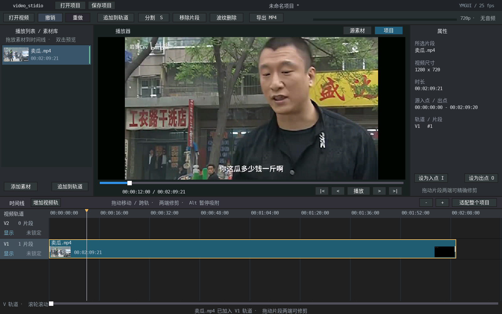

# video_stidio

使用本仓库 YMGUI 编写的 Linux 桌面视频剪辑器，提供素材导入、时间线编辑、预览和 MP4 导出。



截图使用仓库内 `project_Demo/video_player/卖瓜.mp4`：导入后点击“追加到轨道”，再“适配整个项目”，将播放头移到 12 秒。画面、片段和入出点缩略图均由应用实际渲染。

应用直接使用仓库内的 `YMGUI/`、`SDL_LCD/` 和中文字体；媒体处理独立于其他演示应用。

## 构建与运行

在 YMGUI 仓库根目录执行：

```bash
cmake -S project_Demo/video_stidio -B build/rgb565/project_Demo/video_stidio -DCMAKE_BUILD_TYPE=Debug
cmake --build build/rgb565/project_Demo/video_stidio -j8
./build/rgb565/project_Demo/video_stidio/video_stidio
```

也可在命令行传入一个或多个视频路径。启动时是空项目，导入素材不会自动铺满时间线。

依赖：C11 编译器、CMake、GNU make、pkg-config、SDL2 开发包，以及带 `libx264` 编码器的 FFmpeg 命令行。

```bash
sudo apt-get install build-essential cmake pkg-config libsdl2-dev ffmpeg
```

`extern_lib/` 是仓库为 `project_Demo/` 应用准备的第三方依赖目录。本应用默认使用 `extern_lib/FFmpeg` 源码，在应用构建目录内编译配套头文件/静态库；首次构建较慢，后续增量构建，不向源码目录写入生成文件。可用 `-DSTUDIO_FFMPEG_SOURCE=/path/to/FFmpeg` 指定源码位置，用 `-DSTUDIO_FFMPEG_JOBS=8` 调整编译并行数。

没有源码时可安装系统开发包 `libavformat-dev libavcodec-dev libavutil-dev libswscale-dev`，以 `-DSTUDIO_FFMPEG_SOURCE=""` 配置，使用 pkg-config 查找配套头文件和库。代理和导出仍使用 FFmpeg 命令行，路径可由 `-DSTUDIO_PROXY_FFMPEG=/path/to/ffmpeg` 指定。

## 已实现

- 素材列表、单播放器、源素材/项目切换、属性面板、底部时间线。
- 64 项素材、8 条视频轨，每轨 128 个片段；超过四条可在轨道标题区滚轮滚动。
- 素材拖入轨道、追加、跨轨移动、片段两端修剪、分割、普通移除和波纹删除。
- 帧单位时间模型（固定 25 fps），源入点/出点与时间线起点分开保存，原文件不修改。
- 播放头、进度条、播放状态使用 YMGUI subject/bind；拖动实时预览、逐帧步进。
- 端点/播放头吸附，Alt 临时关闭吸附；缩放保持播放头在视口中的位置；拖到水平边缘自动滚动。
- 轨道显示/隐藏、锁定、32 步撤销/重做；点击选择不会生成移动命令，取消拖动不提交编辑。
- `.ymstudio` 项目保存/打开，临时文件写入后原子替换，覆盖及丢弃修改时使用 YMGUI 对话框确认。
- 后台导出 H.264 MP4（1280×720、25 fps、无音频），带绑定进度、取消和失败反馈，导出期间可继续编辑。
- 后台素材读取、原生 FFmpeg 常驻解码器、帧缓存、独立后台预览代理任务。
- 可见片段的真实入点/出点缩略图按需后台加载，修剪后按新的源帧位置读取。

## 操作

| 操作 | 使用方式 |
| --- | --- |
| 导入 | “打开视频”/“添加素材”，或从文件管理器拖入窗口 |
| 预览素材 | 双击素材；播放器上方切换“源素材”/“项目” |
| 加入剪辑 | 拖到目标轨道与位置，或“追加到轨道” |
| 移动 / 修剪 | 拖动片段内部 / 两端的把手 |
| 分割 | 选择片段，将播放头移到分割位置，按 S |
| 普通移除 | Delete，原位置保留空隙 |
| 波纹删除 | Shift+Delete，当前轨道后续片段向前移动 |
| 设置入点 / 出点 | 选择片段，播放头在片段内时按 I / O |
| 播放 / 逐帧 | 空格 / 左右方向键；Home / End 到首尾 |
| 撤销 / 重做 | Ctrl+Z / Ctrl+Shift+Z |
| 保存 / 打开项目 | 顶部按钮，或 Ctrl+S / Ctrl+O |
| 导出成片 | 工具栏“导出 MP4”，选择以 `.mp4` 结尾的文件名；旁边的“取消”可中止任务 |
| 缩放 / 水平滚动 | +/-、Ctrl+滚轮 / 时间线滚轮或底部滚动条 |
| 更多轨道 / 素材 | 在轨道标题区 / 素材列表滚轮滚动 |
| 取消操作 | Esc 关闭弹窗或取消当前拖动，不退出应用 |

拖放重叠时显示红色边框并拒绝提交；当前尚未实现覆盖插入、自动转场。绿色边框表示可放置。素材行右侧黄色条表示代理准备中，绿色表示就绪，红色表示失败并回退到原素材。

## 预览

媒体线程持有 4 个解码上下文和 24 帧缓存；UI 只提交最新目标，不等待解码。松手后提高可接受结果的序号下限，旧请求不能覆盖最终目标。拖动中允许显示已经解出的中间帧，避免请求频繁更新导致画面一直不刷新。

导入后，独立任务用 FFmpeg CLI 生成 640×360、25 fps、全关键帧 MJPEG 代理。**播放/拖头使用原生解码器；离线代理生成和成片编码使用独立 FFmpeg 进程。**代理路径不进入项目文件，原素材路径、尺寸和剪辑数据保留。当前代理是会话临时缓存，正常退出时回收；下次启动会重新生成。

## 成片导出

点击“导出 MP4”会复制当时的项目状态；之后的编辑、撤销或打开其他项目不改变正在渲染的任务。当前一次执行一个任务，视频参数为 H.264、720p、25 fps、CRF 18、无音频。进度条在编码收尾时最多显示 99%，完整文件发布后才显示完成。

导出使用原素材和独立解码器，按与预览相同的片段可见性和源帧采样规则读取画面；不读取预览代理、缩略图或 RGB565 预览缓冲。源画面以 RGB24 缩放/加黑边后交给编码器。轨道隐藏、重叠覆盖、源入点和时间线空隙均按项目状态保留，空隙输出黑帧。

新文件先写入目标目录中的临时文件，编码成功后发布；取消或失败会清理临时文件，不替换已有成片。覆盖需要确认，且导出期间目标文件发生变化时会拒绝替换。不能覆盖原素材，包括指向素材的硬链接。关闭窗口时，如果任务仍在执行，会提示退出将取消导出。

## 测试

```bash
ctest --test-dir build/rgb565/project_Demo/video_stidio --output-on-failure
```

- `studio_fixture`：自动生成 96 秒测试视频，集成测试不依赖其他应用或个人样片。
- `studio_model`：帧边界、轨道覆盖、原子编辑、锁定、撤销边界、项目往返读写及损坏文件。
- `studio_media`：真实不同尺寸视频、末帧、连续目标替换、空画面、无效输入、关闭清理。
- `studio_export`：真实 H.264 输出的帧数、尺寸、裁剪边界、覆盖/隐藏轨道和黑帧；项目快照隔离、进度绑定、取消、解码失败、素材/目标文件保护与临时文件回收。
- `studio_integration`：真实视频、素材拖入轨道后双向移动/跨轨移动/移到零帧、移动保留源范围、修剪/取消、点击不移动、播放头与滑块绑定、撤销重做、代理、入出点缩略图与连续拖头预览。

无头运行和截图：

```bash
SDL_VIDEODRIVER=dummy YMGUI_SHOT=/tmp/studio.bmp \
  ./build/rgb565/project_Demo/video_stidio/video_stidio --frames 120
```

`--frames N` 在 N 次循环后退出；不传此参数则持续运行。命令行其他参数视为要导入的视频路径。

## 当前边界

- 视频轨道按最高可见轨道选取不透明画面；无音频播放/混音、音频波形、透明叠加、转场和滤镜；导出目前只有 720p/25 fps 无音频 MP4 预设。
- 工作台目前为固定 1600×1000 布局（可同时显示 4 条轨道），尚无可停靠/可分离面板。
- 固定项目帧率 25 fps、预览 RGB565/640×360；不支持项目配置切换、色彩管理和完整旋转元数据处理。
- 普通编辑保留源路径；项目依赖原媒体文件的位置，不是素材打包文件。项目长度上限 24 小时。
- 源码模式支持常见 MOV/MP4、Matroska/WebM、AVI，视频解码器包含 H.264、HEVC、MPEG-4、MPEG-2、MJPEG、VP8/VP9；并非 FFmpeg 全格式构建。系统库模式的格式支持取决于安装版本。
- 当前应用使用 POSIX 线程、子进程和文件发布接口，仅支持桌面 Linux，且仅支持 RGB565（`YMGUI_COLOR_DEPTH=16`）。

源码分层见 [ARCHITECTURE.md](ARCHITECTURE.md)。
